# System Overview

## Executive Summary

**Vendor Search v3** is an AI-powered vendor discovery and intelligence platform built with Streamlit, deployed on Azure Container Apps, and integrated with Azure SQL Database. The system enables natural language search across vendor profiles, attachments, and transaction data using hybrid retrieval (FAISS vector search + BM25 lexical search) enhanced by Azure OpenAI.

**Current State:**
- ✅ Functional POC with core search capabilities
- ✅ Azure SQL integration for vendor data
- ✅ Azure OpenAI integration for LLM operations
- ✅ Hybrid search (vector + lexical) with local embeddings
- ⚠️ **Not production-ready**: Missing proper secrets management, observability, persistent storage, and scalability patterns

**Critical Gaps:**
1. **Secrets Management**: Environment variables stored in plain text (`.env` files, Container App env vars)
2. **Persistent Storage**: FAISS index rebuilt on every container restart (no persistent storage)
3. **Observability**: No Application Insights integration, minimal logging
4. **State Management**: Streamlit session state not suitable for multi-instance scaling
5. **Data Loading**: Synchronous SQL queries on every app startup (slow cold starts)

**Production Readiness Score: 4/10**

---

## Repository Structure

```
vendor-search-v3-main/
├── app.py                          # Main Streamlit application (784 lines)
├── Dockerfile                       # Container image definition
├── requirements.txt                # Python dependencies
├── diagnose_deployment.py          # Diagnostic script
│
├── src/                            # Core application modules
│   ├── azure_sql_loader.py        # Azure SQL data loading (128 lines)
│   ├── azure_llm.py               # Azure OpenAI client wrapper (65 lines)
│   ├── build_index.py             # FAISS + BM25 index construction (117 lines)
│   ├── retrieval.py               # Hybrid search engine (579 lines)
│   ├── local_embedder.py          # Sentence transformer embeddings (14 lines)
│   ├── ai_intent.py               # LLM-based intent classification (33 lines)
│   ├── ai_planner.py              # Search plan generation (47 lines)
│   ├── ai_responder.py            # Response generation
│   ├── query_parser.py            # Query parsing (legacy, partially used)
│   ├── query_translation.py       # Multi-language query translation
│   ├── intent_router.py           # Intent routing logic
│   ├── boolean_filter_parser.py   # Boolean filter expression parser
│   ├── file_processor.py          # File upload processing (160 lines)
│   ├── export.py                  # CSV/Excel/PDF export (182 lines)
│   ├── aggregation.py             # Vendor aggregation queries
│   ├── scoring.py                 # Relevance scoring
│   ├── fuzzy_matching.py          # Fuzzy matching utilities
│   ├── synonym_indexer.py         # Synonym expansion
│   ├── vendor_context.py          # Vendor fact lookup
│   ├── vendor_context_query.py    # Context-aware queries
│   ├── external_enrichment.py    # Optional web enrichment
│   ├── presentation_instructions.py # Presentation formatting
│   └── groq_client.py              # Legacy Groq client (unused)
│
├── data/                           # Data files (⚠️ Should be in Azure Storage)
│   ├── vendor_profiles.csv        # Vendor profile data (loaded from SQL)
│   ├── vendor_attachments.csv     # Attachment metadata
│   ├── vendor_transactions.csv    # Transaction data (placeholder)
│   ├── vendor.faiss               # FAISS index file (⚠️ Not persisted)
│   ├── vendor_meta.json           # Metadata cache
│   ├── vendor_docs.json           # Document cache
│   ├── prompts.json               # Quick prompt templates
│   └── taxonomy/                  # Taxonomy data
│       ├── abbreviations.json
│       ├── certification_aliases.json
│       ├── industry_tree.json
│       ├── multilingual_terms.json
│       └── vendor_aliases.json
│
├── scripts/                        # Utility scripts
│   ├── precompute_index.py        # Index precomputation
│   ├── boolean_filter_integration_example.py
│   └── validate_boolean_parser.py
│
└── tests/                          # Test suite (minimal)
    └── test_boolean_parser.py
```

**Key Observations:**
- **Monolithic Structure**: Single `app.py` file (784 lines) handles all UI logic, routing, and business logic
- **Mixed Concerns**: Data loading, indexing, search, and UI all tightly coupled
- **No Configuration Management**: Hard-coded values, environment variables scattered
- **Minimal Testing**: Only one test file for boolean parser

---

## Current Architecture

```mermaid
graph TB
    subgraph "User Browser"
        UI[Streamlit UI]
    end
    
    subgraph "Azure Container Apps"
        APP[app.py<br/>Streamlit App]
        SESSION[Session State<br/>⚠️ In-Memory]
    end
    
    subgraph "Application Logic"
        ROUTER[intent_router.py]
        AI_INTENT[ai_intent.py]
        AI_PLANNER[ai_planner.py]
        RETRIEVAL[retrieval.py]
        EMBEDDER[local_embedder.py<br/>SentenceTransformer]
    end
    
    subgraph "Data Layer"
        SQL[Azure SQL Database<br/>VendorProfile<br/>VendorAttachment]
        SQL_LOADER[azure_sql_loader.py]
        FAISS[FAISS Index<br/>⚠️ In-Memory]
        BM25[BM25 Index<br/>⚠️ In-Memory]
    end
    
    subgraph "AI Services"
        AZURE_LLM[Azure OpenAI<br/>GPT Deployment]
    end
    
    subgraph "File Processing"
        FILE_UPLOAD[File Upload]
        FILE_PROC[file_processor.py]
    end
    
    UI --> APP
    APP --> ROUTER
    ROUTER --> AI_INTENT
    AI_INTENT --> AI_PLANNER
    AI_PLANNER --> RETRIEVAL
    RETRIEVAL --> EMBEDDER
    RETRIEVAL --> FAISS
    RETRIEVAL --> BM25
    APP --> SQL_LOADER
    SQL_LOADER --> SQL
    AI_INTENT --> AZURE_LLM
    AI_PLANNER --> AZURE_LLM
    APP --> FILE_UPLOAD
    FILE_UPLOAD --> FILE_PROC
    APP --> SESSION
    
    style SESSION fill:#ffcccc
    style FAISS fill:#ffcccc
    style BM25 fill:#ffcccc
```



**Architecture Pattern:** Monolithic Streamlit application with embedded search engine

**Key Components:**
1. **Frontend**: Streamlit (single-page chat interface)
2. **Search Engine**: Hybrid FAISS (vector) + BM25 (lexical) with local embeddings
3. **LLM Integration**: Azure OpenAI for intent classification, planning, and response generation
4. **Data Source**: Azure SQL Database (vendor profiles, attachments)
5. **Index Storage**: ⚠️ **In-memory only** (rebuilt on every container restart)

---

## Deployment Architecture

```mermaid
graph TB
    subgraph "GitHub Repository"
        CODE[Source Code]
    end
    
    subgraph "Azure Container Registry"
        IMAGE[Container Image<br/>python:3.11-slim]
    end
    
    subgraph "Azure Container Apps"
        CONTAINER[Container Instance<br/>⚠️ Stateless]
        ENV_VARS[Environment Variables<br/>⚠️ Plain Text Secrets]
    end
    
    subgraph "Azure SQL Database"
        SQL_DB[(VendorProfile<br/>VendorAttachment)]
    end
    
    subgraph "Azure OpenAI"
        OPENAI[GPT Deployment]
    end
    
    subgraph "Storage - MISSING"
        KV[Key Vault<br/>❌ Not Used]
        FILE_SHARE[Azure File Share<br/>❌ Not Used]
        BLOB[Blob Storage<br/>❌ Not Used]
        APP_INSIGHTS[Application Insights<br/>❌ Not Used]
    end
    
    CODE -->|Build| IMAGE
    IMAGE -->|Deploy| CONTAINER
    CONTAINER -->|Read| SQL_DB
    CONTAINER -->|Call| OPENAI
    CONTAINER -.->|Should Use| KV
    CONTAINER -.->|Should Use| FILE_SHARE
    CONTAINER -.->|Should Use| APP_INSIGHTS
    
    style KV fill:#ffcccc
    style FILE_SHARE fill:#ffcccc
    style BLOB fill:#ffcccc
    style APP_INSIGHTS fill:#ffcccc
    style ENV_VARS fill:#ffcccc
    style CONTAINER fill:#ffcccc
```



**Current Deployment Flow:**
1. Code pushed to GitHub
2. Container image built (Dockerfile)
3. Deployed to Azure Container Apps
4. **On Startup**: 
   - Loads data from Azure SQL (`azure_sql_loader.py:28-78`)
   - Builds FAISS index in-memory (`build_index.py:99-116`)
   - Builds BM25 index in-memory
   - **Problem**: This happens on EVERY container restart/scale-out

**Missing Azure Services:**
- ❌ Azure Key Vault (secrets management)
- ❌ Azure File Share (persistent FAISS index storage)
- ❌ Azure Blob Storage (file uploads, taxonomy data)
- ❌ Application Insights (observability)

---

## Architecture Analysis

### 1. Current Architecture Pattern

**Pattern:** Monolithic Streamlit Application with Embedded Search

**Strengths:**
- Simple deployment model (single container)
- Fast development iteration
- All-in-one solution reduces operational complexity

**Weaknesses:**
- **Tight Coupling**: UI, business logic, and data access all in `app.py`
- **Not Scalable**: Streamlit session state doesn't work across multiple instances
- **Stateful Components**: FAISS/BM25 indices in memory (lost on restart)
- **Cold Start Problem**: Index rebuild on every container start (see `app.py:79-85`)

### 2. Coupling & Separation of Concerns

**Issues Identified:**

1. **`app.py` (784 lines)** - Violates Single Responsibility Principle
   - UI rendering (lines 126-264)
   - Business logic (lines 318-343)
   - Security guards (lines 28-47, 435-448)
   - Rate limiting (lines 435-448)
   - File processing orchestration (lines 389-434)
   - Search orchestration (lines 686-783)

2. **Data Loading Coupling** (`azure_sql_loader.py:28-78`)
   - Synchronous SQL queries on app startup
   - No connection pooling
   - No caching layer
   - Blocks application startup

3. **Index Building Coupling** (`build_index.py:99-116`)
   - Executed on every container start
   - No pre-computation or persistence
   - Blocks application readiness

**Recommendation:** Extract into separate services:
- **API Service**: FastAPI/Flask for business logic
- **Index Service**: Background service for index management
- **Frontend**: Streamlit or React for UI

### 3. Stateless vs Stateful Components

**Stateful (Problematic for Scaling):**

| Component | Location | Issue | Impact |
|-----------|----------|-------|--------|
| FAISS Index | `app.py:87` (in-memory) | Lost on restart | Cold start delay |
| BM25 Index | `app.py:87` (in-memory) | Lost on restart | Cold start delay |
| Session State | `app.py:102-123` | Streamlit session | Doesn't scale horizontally |
| Embedding Model | `local_embedder.py:6` (global) | Loaded per instance | Memory overhead |

**Stateless (Good):**
- Azure SQL queries (stateless)
- Azure OpenAI calls (stateless)
- File processing (stateless)

**Critical Issue:** Container Apps can scale to multiple instances, but:
- Each instance rebuilds the index independently
- Session state is per-instance (no shared state)
- No coordination between instances

### 4. Scalability Readiness

**Current Limitations:**

1. **Horizontal Scaling**: ❌ **Not Ready**
   - Streamlit session state is per-instance
   - No shared cache for indices
   - No load balancer session affinity configured

2. **Vertical Scaling**: ⚠️ **Limited**
   - Memory: FAISS index + embedding model (~500MB-1GB per instance)
   - CPU: Embedding computation is CPU-bound
   - No resource limits configured in Container Apps

3. **Data Volume**: ⚠️ **Unknown Limits**
   - No pagination for SQL queries (loads all vendors)
   - No streaming for large result sets
   - FAISS index size grows linearly with vendor count

**Scalability Bottlenecks:**
- `azure_sql_loader.py:28-78`: Loads ALL vendor profiles on startup
- `build_index.py:99-116`: Builds index for ALL vendors synchronously
- `local_embedder.py:8-13`: Embedding computation (CPU-bound, no batching)

### 5. Risks & Technical Debt

**High Priority Risks:**

1. **Data Loss Risk** (Critical)
   - **File**: `app.py:87` - FAISS index in-memory
   - **Impact**: Index lost on container restart/scale
   - **Mitigation**: Move to Azure File Share

2. **Security Risk** (Critical)
   - **File**: `azure_sql_loader.py:8-12` - SQL credentials in env vars
   - **File**: `azure_llm.py:9-11` - OpenAI key in env vars
   - **Impact**: Secrets exposed in Container App environment variables
   - **Mitigation**: Use Azure Key Vault

3. **Performance Risk** (High)
   - **File**: `app.py:79-85` - Index rebuild on every start
   - **Impact**: 30-60 second cold start delay
   - **Mitigation**: Pre-compute and persist index

4. **Observability Gap** (High)
   - **File**: No Application Insights integration
   - **Impact**: No visibility into errors, performance, usage
   - **Mitigation**: Add Application Insights SDK

5. **Error Handling** (Medium)
   - **File**: `azure_llm.py:59-64` - Generic exception handling
   - **File**: `azure_sql_loader.py:28` - No retry logic
   - **Impact**: Silent failures, no retry on transient errors

**Technical Debt:**

- **Legacy Code**: `groq_client.py` (unused, should be removed)
- **Duplicate Logic**: `query_parser.py` vs `ai_planner.py` (both parse queries)
- **Hard-coded Values**: Magic numbers in `retrieval.py:19-35` (weights, thresholds)
- **No Configuration Layer**: Environment variables scattered, no validation

---

## Code Quality Analysis

### 1. Folder Structure & Modularity

**Current Structure:**
```
src/
├── 25 Python modules
├── Mixed responsibilities (AI, data, search, export)
└── No clear service boundaries
```

**Issues:**
- **Flat Structure**: All modules at same level, no grouping by domain
- **Naming Inconsistency**: `azure_llm.py` vs `groq_client.py` (both LLM clients)
- **Circular Dependencies Risk**: Many modules import from each other

**Recommendation:**
```
src/
├── services/          # Business logic services
│   ├── search_service.py
│   ├── vendor_service.py
│   └── file_service.py
├── ai/                # AI/LLM integration
│   ├── azure_llm.py
│   ├── intent_classifier.py
│   └── query_planner.py
├── data/              # Data access layer
│   ├── sql_loader.py
│   └── index_builder.py
├── search/            # Search engine
│   ├── retrieval.py
│   ├── embedding.py
│   └── scoring.py
└── utils/             # Utilities
    ├── export.py
    └── file_processor.py
```

### 2. Maintainability

**Code Metrics:**

| Metric | Value | Status |
|--------|-------|--------|
| Largest File | `app.py` (784 lines) | ⚠️ Too large |
| Average File Size | ~150 lines | ✅ Good |
| Cyclomatic Complexity | High in `app.py` | ⚠️ Complex |
| Test Coverage | <5% | ❌ Very low |

**Maintainability Issues:**

1. **`app.py` Complexity**
   - 784 lines, 20+ functions
   - Mixed concerns (UI, business logic, security)
   - Hard to test, hard to modify

2. **Error Handling**
   - **File**: `azure_llm.py:59-64` - Generic `RuntimeError`, no retry
   - **File**: `azure_sql_loader.py:28` - No connection error handling
   - **File**: `build_index.py:99` - No error handling for index build failures

3. **Code Duplication**
   - Query parsing logic in both `query_parser.py` and `ai_planner.py`
   - Filter application logic duplicated in `retrieval.py:46-214`

### 3. Error Handling & Logging

**Current State:**

**Logging:**
- **File**: `external_enrichment.py:31` - Only module with logging
- **File**: `app.py` - No logging, uses Streamlit messages
- **File**: `azure_llm.py` - No logging for API failures

**Error Handling Patterns:**

```python
# Good: Specific error handling
# File: file_processor.py:20-28
try:
    return file_data.decode('utf-8')
except UnicodeDecodeError:
    return file_data.decode('latin-1', errors='ignore')

# Bad: Generic exception swallowing
# File: ai_planner.py:37
except:
    return default_dict  # Silent failure, no logging
```

**Missing Error Handling:**
- SQL connection failures (`azure_sql_loader.py:28`)
- Index build failures (`build_index.py:99`)
- Embedding model loading failures (`local_embedder.py:10`)

**Recommendation:**
- Add structured logging (Python `logging` module)
- Integrate with Application Insights
- Add retry logic for transient failures
- Add circuit breakers for external services

### 4. Config & Environment Management

**Current Approach:**

**Files Using Environment Variables:**
- `app.py:53-54` - `VENDOR_PROFILE_BASE_URL`, `EXTERNAL_ENRICHMENT_ENABLED`
- `azure_sql_loader.py:8-11` - SQL credentials
- `azure_llm.py:9-16` - OpenAI credentials
- `local_embedder.py:5` - Embedding model name
- `external_enrichment.py:21-25` - API keys

**Issues:**
1. **No Validation**: No check if required env vars are set at startup
2. **No Defaults**: Some vars have defaults, others don't (inconsistent)
3. **No Type Conversion**: All strings, no type validation
4. **Secrets in Plain Text**: Stored in Container App env vars (visible in Azure Portal)

**Recommendation:**
```python
# config.py
from pydantic import BaseSettings
from azure.keyvault.secrets import SecretClient

class Settings(BaseSettings):
    azure_sql_server: str
    azure_sql_username: str
    azure_sql_password: str  # From Key Vault
    azure_openai_endpoint: str
    azure_openai_key: str  # From Key Vault
    
    class Config:
        env_file = ".env"
```

### 5. Refactoring Opportunities

**High Priority:**

1. **Extract Business Logic from `app.py`**
   - Create `services/search_service.py`
   - Create `services/vendor_service.py`
   - Keep `app.py` as thin UI layer

2. **Separate Index Management**
   - Create `services/index_service.py`
   - Move index building to background job
   - Add index persistence to Azure File Share

3. **Unify Query Parsing**
   - Remove `query_parser.py` (legacy)
   - Use `ai_planner.py` as single source of truth
   - Add caching for parsed queries

4. **Add Configuration Layer**
   - Create `config.py` with Pydantic settings
   - Validate on startup
   - Load secrets from Key Vault

5. **Improve Error Handling**
   - Add custom exception classes
   - Add retry decorators
   - Add structured logging

---

## Product Assessment

### 1. What Problem This Solves

**Primary Use Case:** Vendor Discovery & Intelligence

**Problem Statement:**
Organizations need to find vendors matching specific criteria (capabilities, location, certifications) from a large database. Traditional keyword search is insufficient for:
- Natural language queries ("Find cybersecurity vendors in Malaysia with ISO27001")
- Semantic matching (synonyms, related terms)
- Multi-criteria filtering (industry + location + certifications)

**Solution:**
AI-powered hybrid search combining:
- **Vector Search** (FAISS): Semantic similarity matching
- **Lexical Search** (BM25): Keyword matching
- **LLM Enhancement**: Intent classification, query planning, response generation

### 2. Feature Maturity

**Mature Features (Production-Ready):**
- ✅ Basic vendor search by text query
- ✅ Filter by industry, location, certifications
- ✅ File upload and processing
- ✅ Export to CSV/Excel/PDF
- ✅ Multi-language query support

**Partially Mature (Needs Work):**
- ⚠️ Boolean filter expressions (new feature, limited testing)
- ⚠️ Aggregation queries (basic implementation)
- ⚠️ Vendor context queries (fact lookup)

**Immature/Experimental:**
- ❌ External enrichment (optional, basic implementation)
- ❌ Duplicate detection (not integrated)
- ❌ Performance/compliance scoring (simplified logic)

### 3. Missing Enterprise-Grade Capabilities

**Critical Gaps:**

1. **Authentication & Authorization**
   - **Current**: None (public Streamlit app)
   - **Needed**: Azure AD integration, role-based access control

2. **Audit Trail**
   - **Current**: No logging of user queries or results
   - **Needed**: Query logging, result tracking, compliance reporting

3. **Rate Limiting**
   - **Current**: Basic in-memory rate limiting (`app.py:435-448`)
   - **Needed**: Distributed rate limiting (Redis), per-user quotas

4. **Data Governance**
   - **Current**: No data retention policies
   - **Needed**: Query history retention, data export, GDPR compliance

5. **Performance Monitoring**
   - **Current**: No metrics collection
   - **Needed**: Query latency, error rates, user activity metrics

6. **Multi-tenancy**
   - **Current**: Single-tenant (all users see all vendors)
   - **Needed**: Tenant isolation, data filtering by organization

### 4. UX / Workflow Gaps

**Current UX Issues:**

1. **Cold Start Experience**
   - **Problem**: 30-60 second delay on first query (index building)
   - **Impact**: Poor first impression
   - **Fix**: Pre-compute index, show loading state

2. **Error Messages**
   - **Problem**: Generic errors ("I couldn't interpret that request")
   - **Impact**: User confusion
   - **Fix**: Specific error messages, suggestions

3. **Result Presentation**
   - **Problem**: Fixed table format, limited customization
   - **Impact**: Users can't tailor view to their needs
   - **Fix**: Customizable columns, saved views

4. **Search History**
   - **Problem**: No history of previous searches
   - **Impact**: Users can't revisit results
   - **Fix**: Search history sidebar, saved searches

5. **Feedback Loop**
   - **Problem**: No way to provide feedback on results
   - **Impact**: Can't improve search quality
   - **Fix**: Thumbs up/down, result relevance feedback

### 5. Auditability & Compliance Readiness

**Current State:**
- ❌ No audit logging
- ❌ No query history
- ❌ No user tracking
- ❌ No data access logs

**Compliance Requirements (Typical):**

1. **GDPR/Privacy**
   - Need: User consent, data deletion, access logs
   - Status: ❌ Not implemented

2. **SOC 2**
   - Need: Access controls, audit trails, encryption
   - Status: ❌ Not implemented

3. **ISO 27001**
   - Need: Security controls, incident response, monitoring
   - Status: ⚠️ Partial (basic security guards in `app.py`)

**Recommendation:**
- Add audit logging table in Azure SQL
- Log all queries, results, user actions
- Integrate with Azure Monitor for compliance reporting

---

## Azure Infrastructure Assessment

### 1. Current Deployment Model

**Container Apps Configuration:**
- **Image**: Built from `Dockerfile` (python:3.11-slim)
- **Port**: 8501 (Streamlit default)
- **Scaling**: Manual/auto-scaling (not configured)
- **Environment Variables**: Plain text secrets (⚠️ Security risk)

**Deployment Process:**
1. Code → GitHub
2. Build container image (Dockerfile)
3. Push to Azure Container Registry
4. Deploy to Container Apps
5. **On Startup**: Load data, build index (30-60 seconds)

### 2. What Is Not Cloud-Ready

**Critical Issues:**

1. **Secrets Management** ❌
   - **Current**: Environment variables in Container Apps
   - **Files**: `azure_sql_loader.py:8-11`, `azure_llm.py:9-11`
   - **Risk**: Secrets visible in Azure Portal, logs, container inspection
   - **Fix**: Use Azure Key Vault with Managed Identity

2. **Persistent Storage** ❌
   - **Current**: FAISS index in-memory (`app.py:87`)
   - **Impact**: Index rebuilt on every restart (slow, wasteful)
   - **Fix**: Store index in Azure File Share, mount to container

3. **Observability** ❌
   - **Current**: No Application Insights integration
   - **Impact**: No visibility into errors, performance, usage
   - **Fix**: Add Application Insights SDK, structured logging

4. **Configuration Management** ❌
   - **Current**: Hard-coded values, scattered env vars
   - **Impact**: Hard to manage across environments
   - **Fix**: Use Azure App Configuration or Key Vault

5. **Health Checks** ⚠️
   - **Current**: No health check endpoint
   - **Impact**: Container Apps can't detect unhealthy instances
   - **Fix**: Add `/health` endpoint

6. **Resource Limits** ⚠️
   - **Current**: No CPU/memory limits configured
   - **Impact**: Risk of resource exhaustion
   - **Fix**: Set appropriate limits in Container Apps

### 3. What Should Move to File Share vs Blob Storage

**Azure File Share (Persistent, Mountable):**
- ✅ **FAISS Index** (`data/vendor.faiss`)
  - **Reason**: Needs to be mounted to container, accessed as file system
  - **Size**: ~100-500MB (depends on vendor count)
  - **Access Pattern**: Read on startup, write on index update

- ✅ **BM25 Index** (if persisted)
  - **Reason**: Similar to FAISS, needs file system access
  - **Size**: ~50-200MB

- ✅ **Taxonomy Files** (`data/taxonomy/*.json`)
  - **Reason**: Read frequently, small files, needs file system access
  - **Size**: ~1-5MB total

**Azure Blob Storage (Object Storage):**
- ✅ **Uploaded Files** (user uploads)
  - **Reason**: Large files, infrequent access, no file system needed
  - **Size**: Variable (up to 10MB per file, `app.py:363`)
  - **Access Pattern**: Write on upload, read on query

- ✅ **Vendor Attachments** (if storing file content)
  - **Reason**: Large files, archival storage
  - **Size**: Variable (could be GBs)

- ✅ **Export Files** (CSV/Excel/PDF exports)
  - **Reason**: Generated files, temporary storage
  - **Size**: Variable (depends on result set)

- ✅ **Backup Data** (CSV exports from SQL)
  - **Reason**: Backup/archival, infrequent access
  - **Size**: Variable

**Current State Analysis:**
- **File**: `app.py:389-434` - Files stored in Streamlit session (in-memory)
- **File**: `data/vendor.faiss` - Index file exists but not used (rebuilt each time)
- **File**: `data/taxonomy/` - Taxonomy files in repo (should be in File Share)

### 4. Secrets Management

**Current Secrets (Exposed in Env Vars):**

| Secret | Location | Current Storage | Risk Level |
|-------|----------|----------------|------------|
| `AZURE_SQL_PASSWORD` | `azure_sql_loader.py:10` | Container App env var | 🔴 Critical |
| `AZURE_OPENAI_KEY` | `azure_llm.py:9` | Container App env var | 🔴 Critical |
| `AZURE_SQL_USERNAME` | `azure_sql_loader.py:9` | Container App env var | 🟡 Medium |
| `AZURE_SQL_SERVER` | `azure_sql_loader.py:8` | Container App env var | 🟢 Low |
| `AZURE_OPENAI_ENDPOINT` | `azure_llm.py:16` | Container App env var | 🟢 Low |

**Recommendation:**
1. **Create Azure Key Vault**
2. **Store secrets in Key Vault**
3. **Use Managed Identity** (no service principal needed)
4. **Update code** to read from Key Vault:

```python
# azure_keyvault.py (new file)
from azure.keyvault.secrets import SecretClient
from azure.identity import DefaultAzureCredential

def get_secret(secret_name: str) -> str:
    credential = DefaultAzureCredential()
    client = SecretClient(vault_url="https://<vault>.vault.azure.net/", credential=credential)
    return client.get_secret(secret_name).value
```

### 5. Observability Gaps

**Missing Observability:**

1. **Application Insights** ❌
   - No integration
   - No custom metrics
   - No distributed tracing

2. **Structured Logging** ❌
   - Only `external_enrichment.py:31` uses logging
   - No log levels, no correlation IDs
   - No log aggregation

3. **Metrics** ❌
   - No query latency tracking
   - No error rate monitoring
   - No user activity metrics

4. **Alerts** ❌
   - No alerting on errors
   - No alerting on performance degradation
   - No alerting on resource exhaustion

**Recommendation:**
```python
# Add to app.py
from opencensus.ext.azure.log_exporter import AzureLogHandler
import logging

logger = logging.getLogger(__name__)
logger.addHandler(AzureLogHandler(connection_string="<APP_INSIGHTS_CONN_STRING>"))

# Instrument key operations
logger.info("Search query", extra={
    "query": user_text,
    "result_count": len(results),
    "latency_ms": elapsed_time
})
```

### 6. Recommended Azure Architecture


**Key Improvements:**
1. **Persistent Storage**: File Share for indices, Blob for files
2. **Secrets Management**: Key Vault with Managed Identity
3. **Observability**: Application Insights for monitoring
4. **Scalability**: Multiple instances with shared storage
5. **Security**: Azure AD authentication

---

## Recommended Architecture


**Architecture Principles:**
1. **Separation of Concerns**: UI, API, Business Logic, Data layers
2. **Stateless Services**: All services stateless, state in storage/cache
3. **Scalability**: Horizontal scaling with shared storage
4. **Resilience**: Retry logic, circuit breakers, health checks
5. **Observability**: Comprehensive logging, metrics, tracing

**Migration Path:**
1. **Phase 1**: Add Key Vault, File Share, Application Insights (minimal code changes)
2. **Phase 2**: Extract API layer, add caching
3. **Phase 3**: Refactor to microservices (if needed)

---

## Improvement Roadmap

### Short Term (1-2 Months)

**Priority: Critical - Production Readiness**

1. **Secrets Management** (Week 1)
   - [ ] Create Azure Key Vault
   - [ ] Migrate secrets from env vars to Key Vault
   - [ ] Update `azure_sql_loader.py` to use Key Vault
   - [ ] Update `azure_llm.py` to use Key Vault
   - [ ] Enable Managed Identity for Container Apps
   - **Files**: `azure_sql_loader.py`, `azure_llm.py`, new `azure_keyvault.py`

2. **Persistent Storage** (Week 2)
   - [ ] Create Azure File Share
   - [ ] Mount File Share to Container Apps
   - [ ] Persist FAISS index to File Share (`build_index.py`)
   - [ ] Load index from File Share on startup (`app.py:79-85`)
   - [ ] Move taxonomy files to File Share
   - **Files**: `build_index.py`, `app.py`, `local_embedder.py`

3. **Observability** (Week 3)
   - [ ] Create Application Insights workspace
   - [ ] Add Application Insights SDK to `requirements.txt`
   - [ ] Add structured logging throughout codebase
   - [ ] Instrument key operations (search, LLM calls, SQL queries)
   - [ ] Create dashboards for key metrics
   - **Files**: All source files, new `logging_config.py`

4. **Error Handling** (Week 4)
   - [ ] Add retry logic for SQL connections (`azure_sql_loader.py`)
   - [ ] Add retry logic for OpenAI calls (`azure_llm.py`)
   - [ ] Add circuit breakers for external services
   - [ ] Improve error messages for users
   - **Files**: `azure_sql_loader.py`, `azure_llm.py`, new `retry_utils.py`

5. **Health Checks** (Week 4)
   - [ ] Add `/health` endpoint to Streamlit app
   - [ ] Configure health probe in Container Apps
   - [ ] Check index availability, SQL connectivity, OpenAI connectivity
   - **Files**: `app.py` (new endpoint)

### Mid Term (3-6 Months)

**Priority: High - Scalability & Maintainability**

6. **Code Refactoring** (Month 3)
   - [ ] Extract business logic from `app.py` to service layer
   - [ ] Create `services/search_service.py`
   - [ ] Create `services/vendor_service.py`
   - [ ] Create `services/file_service.py`
   - [ ] Reduce `app.py` to thin UI layer (<200 lines)
   - **Files**: New `services/` directory, refactor `app.py`

7. **Caching Layer** (Month 4)
   - [ ] Add Azure Redis Cache
   - [ ] Cache query results (TTL: 1 hour)
   - [ ] Cache vendor profiles (TTL: 24 hours)
   - [ ] Cache embedding results (TTL: 7 days)
   - **Files**: New `cache.py`, update `retrieval.py`, `azure_sql_loader.py`

8. **Configuration Management** (Month 4)
   - [ ] Create `config.py` with Pydantic settings
   - [ ] Validate configuration on startup
   - [ ] Use Azure App Configuration (optional)
   - [ ] Remove hard-coded values
   - **Files**: New `config.py`, update all modules

9. **Testing** (Month 5)
   - [ ] Add unit tests for core services (target: 60% coverage)
   - [ ] Add integration tests for search functionality
   - [ ] Add E2E tests for critical user flows
   - [ ] Set up CI/CD with test execution
   - **Files**: New `tests/` directory, expand test coverage

10. **Performance Optimization** (Month 6)
    - [ ] Optimize SQL queries (add indexes, pagination)
    - [ ] Batch embedding computation (`local_embedder.py`)
    - [ ] Implement query result streaming
    - [ ] Add connection pooling for SQL
    - **Files**: `azure_sql_loader.py`, `local_embedder.py`, `retrieval.py`

### Long Term (6-12 Months)

**Priority: Medium - Enterprise Features**

11. **Authentication & Authorization** (Month 7)
    - [ ] Integrate Azure AD authentication
    - [ ] Add role-based access control (RBAC)
    - [ ] Implement user session management
    - [ ] Add audit logging for user actions
    - **Files**: New `auth.py`, update `app.py`

12. **API Layer** (Month 8)
    - [ ] Create FastAPI service for business logic
    - [ ] Expose REST API endpoints
    - [ ] Keep Streamlit as frontend, call API
    - [ ] Add API versioning
    - **Files**: New `api/` directory, refactor services

13. **Multi-tenancy** (Month 9)
    - [ ] Add tenant isolation to data layer
    - [ ] Filter vendors by organization/tenant
    - [ ] Add tenant-specific configuration
    - **Files**: Update `azure_sql_loader.py`, `retrieval.py`

14. **Advanced Features** (Month 10-12)
    - [ ] Implement search history and saved searches
    - [ ] Add result relevance feedback
    - [ ] Implement query suggestions/autocomplete
    - [ ] Add vendor comparison feature
    - [ ] Implement export scheduling
    - **Files**: Various new features

15. **Microservices Migration** (Month 12, if needed)
    - [ ] Evaluate if microservices architecture is needed
    - [ ] If yes, split into: Search Service, Vendor Service, File Service
    - [ ] Use Azure Service Bus for inter-service communication
    - [ ] Implement distributed tracing
    - **Files**: Major refactoring

---

## Open Questions

### Technical Questions

1. **Index Update Strategy**
   - **Question**: How often does vendor data change? Do we need real-time index updates?
   - **Current**: Index rebuilt on every container restart (inefficient)
   - **Options**: 
     - Scheduled index rebuild (daily/weekly)
     - Event-driven updates (Azure Functions on SQL changes)
     - Incremental updates (update only changed vendors)

2. **Scaling Strategy**
   - **Question**: What is the expected user load? Concurrent users? Queries per second?
   - **Current**: No load testing, unknown capacity
   - **Options**:
     - Horizontal scaling (multiple Container App instances)
     - Vertical scaling (larger container resources)
     - Hybrid (both)

3. **Embedding Model**
   - **Question**: Is `sentence-transformers/all-MiniLM-L6-v2` sufficient for production?
   - **Current**: Local embedding model (384 dimensions)
   - **Options**:
     - Keep local model (fast, free)
     - Use Azure OpenAI embeddings (better quality, cost)
     - Use Azure Cognitive Services (managed, scalable)

4. **Data Volume**
   - **Question**: How many vendors? Expected growth rate?
   - **Current**: Loads all vendors into memory (no pagination)
   - **Impact**: Memory usage, index size, query performance
   - **Options**:
     - Pagination for SQL queries
     - Sharding for large datasets
     - Archival strategy for old vendors

### Business Questions

5. **User Access**
   - **Question**: Who are the users? Internal employees? External partners?
   - **Current**: No authentication (public app)
   - **Impact**: Security, compliance, audit requirements
   - **Options**: Azure AD, API keys, custom auth

6. **Data Sensitivity**
   - **Question**: Is vendor data sensitive? PII? Confidential?
   - **Current**: No encryption at rest (beyond Azure SQL default)
   - **Impact**: Compliance requirements, security controls
   - **Options**: Encryption, data masking, access controls

7. **Compliance Requirements**
   - **Question**: What compliance standards apply? GDPR? SOC 2? ISO 27001?
   - **Current**: Basic security guards, no audit logging
   - **Impact**: Required features, architecture decisions
   - **Options**: Audit logging, data retention, access controls

8. **SLA Requirements**
   - **Question**: What is the required uptime? Response time SLA?
   - **Current**: No SLA defined, no monitoring
   - **Impact**: Infrastructure decisions, redundancy requirements
   - **Options**: Multi-region deployment, backup strategies

### Operational Questions

9. **Deployment Frequency**
   - **Question**: How often will we deploy? Daily? Weekly?
   - **Current**: Manual deployment process
   - **Impact**: CI/CD requirements, testing strategy
   - **Options**: GitHub Actions, Azure DevOps, automated testing

10. **Disaster Recovery**
    - **Question**: What is the RTO/RPO requirement?
    - **Current**: No backup strategy, no DR plan
    - **Impact**: Backup frequency, replication strategy
    - **Options**: Geo-replication, automated backups, failover

11. **Cost Optimization**
    - **Question**: What is the budget? Cost per query target?
    - **Current**: No cost monitoring, unknown Azure spend
    - **Impact**: Service selection, optimization priorities
    - **Options**: Cost monitoring, reserved instances, spot pricing

---

## Conclusion

**Vendor Search v3** is a functional POC with solid core functionality but requires significant work to be production-ready. The most critical gaps are:

1. **Secrets Management** (Critical) - Move to Key Vault
2. **Persistent Storage** (Critical) - Move indices to File Share
3. **Observability** (High) - Add Application Insights
4. **Code Quality** (High) - Refactor `app.py`, add tests
5. **Scalability** (Medium) - Add caching, optimize queries

**Recommended Approach:**
- **Short Term**: Focus on production readiness (secrets, storage, observability)
- **Mid Term**: Improve maintainability and scalability (refactoring, caching)
- **Long Term**: Add enterprise features (auth, multi-tenancy, API layer)

**Estimated Effort:**
- **Short Term**: 4-6 weeks (1 developer)
- **Mid Term**: 3-4 months (1-2 developers)
- **Long Term**: 6-12 months (2-3 developers)

**Risk Assessment:**
- **Current Risk Level**: 🔴 **High** (not production-ready)
- **After Short Term**: 🟡 **Medium** (production-ready with limitations)
- **After Mid Term**: 🟢 **Low** (production-ready, scalable)

---

**Document Version**: 1.0  
**Last Updated**: 2024  
**Author**: System Analysis (Software Architect + Senior Developer + Product Manager + Azure Cloud Architect)

